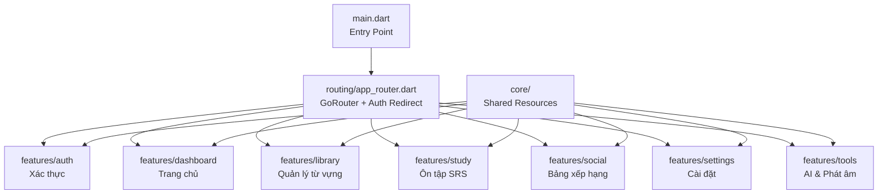
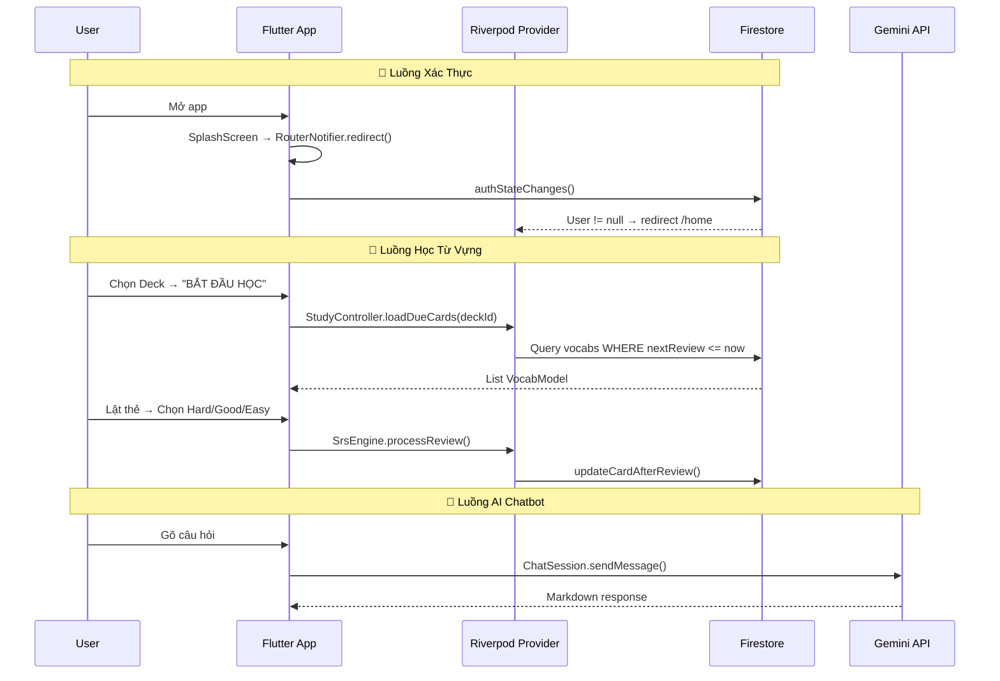

# 📚 VitaminC - Phân Tích Toàn Bộ Codebase

> **Ứng dụng học tiếng Anh trên Flutter** sử dụng Firebase, Riverpod, GoRouter, thuật toán SRS (SM-2), Gemini AI và Speech-to-Text.

---

## 1. Tổng Quan Kiến Trúc



**Tech Stack:**
| Công nghệ | Vai trò |
|---|---|
| Flutter + Dart | Framework UI |
| Riverpod | State Management |
| GoRouter | Routing & Deep linking |
| Firebase Auth | Xác thực (Email, Google, Facebook) |
| Cloud Firestore | CSDL NoSQL |
| Google Generative AI (Gemini) | Chatbot AI dạy tiếng Anh |
| Speech-to-Text | Nhận diện giọng nói chấm phát âm |
| Google Fonts (Lexend) | Typography |

---

## 2. Cấu Trúc Thư Mục `lib/`

```
lib/
├── main.dart                          # Entry point, khởi tạo Firebase + App
├── core/
│   ├── constants/app_colors.dart      # Bảng màu toàn app
│   ├── models/user_model.dart         # Model người dùng
│   ├── shared_widgets/               # Widget dùng chung
│   │   ├── bottom_nav_bar.dart
│   │   ├── custom_app_bar.dart
│   │   ├── custom_button.dart
│   │   ├── custom_label.dart
│   │   ├── custom_text_field.dart
│   │   └── srs_button.dart
│   ├── theme/                         # (Trống - chưa triển khai)
│   └── utils/
│       ├── dummy_data.dart            # Dữ liệu giả cho Social
│       └── firestore_collections.dart # Tên collection Firestore
├── features/
│   ├── auth/                          # Xác thực & quản lý User
│   ├── dashboard/                     # Trang chủ (HomeScreen)
│   ├── library/                       # Quản lý Deck + Vocab
│   ├── study/                         # Ôn tập Flashcard + SRS Engine
│   ├── social/                        # Leaderboard + Badges + Streak
│   ├── settings/                      # Hồ sơ cá nhân
│   └── tools/                         # AI Chatbot + Pronunciation
└── routing/
    └── app_router.dart                # Cấu hình GoRouter
```

---

## 3. Chi Tiết Từng File

### 3.1 `main.dart` — Entry Point
- Khởi tạo `WidgetsFlutterBinding`, load `.env`, khởi tạo `Firebase`
- Bọc app trong `ProviderScope` (Riverpod)
- `VitaminCApp` là `ConsumerWidget`, dùng `MaterialApp.router` với `routerConfig` từ `routerProvider`
- Theme: Material 3, font Lexend, màu chủ đạo `AppColors.primary`

### 3.2 `routing/app_router.dart` — Điều hướng
- **`RouterNotifier`**: Lắng nghe `authStateProvider` + `currentUserProvider`, gọi `notifyListeners()` khi auth thay đổi
- **`redirect()`**: Logic bảo vệ route:
  - Chưa đăng nhập → redirect `/login`
  - Đã đăng nhập mà đang ở auth path → redirect `/home`
- **Routes**:
  - Độc lập: `/splash`, `/onboarding`, `/login`
  - `ShellRoute` (có BottomNav): `/home`, `/library`, `/social`, `/settings`
  - Full-screen: `/deck-detail`, `/add-vocab`, `/study`, `/study-summary`, `/pronunciation`, `/chatbot`

---

### 3.3 `core/` — Tầng dùng chung

#### `app_colors.dart`
- Bảng màu Slate (100→900), accent (gold, bronze, streakOrange), trạng thái (success/warning/error)

#### `user_model.dart`
- Fields: `uid`, `email`, `displayName`, `photoUrl`, `role` (admin/user), `xp`, `rank`
- Có `toMap()` / `fromMap()` cho Firestore serialization

#### Shared Widgets
| Widget | Mô tả |
|---|---|
| `MainBottomNavBar` | 4 tab (Home, Library, Social, Profile), dùng `GoRouter` navigate |
| `CustomAppBar` | AppBar trong suốt, nút back tự detect `canPop()` |
| `CustomPrimaryButton` | Nút full-width, bo góc 12, màu primary |
| `CustomLabel` | Nhãn song ngữ (English - Vietnamese) |
| `CustomTextField` | Input có icon prefix, hỗ trợ password |
| `SrsButton` | Nút đánh giá SRS (Hard/Good/Easy) |

#### `firestore_collections.dart`
- Định nghĩa tên collection: `users`, `global_decks`, `decks` (sub), `vocabs` (sub)

#### `dummy_data.dart`
- Dữ liệu tĩnh cho Leaderboard, Badges (chưa kết nối Firestore)

---

### 3.4 `features/auth/` — Xác Thực

#### Data Layer

**`auth_repository.dart`** — Logic xác thực chính:
| Hàm | Mô tả |
|---|---|
| `getUserData(uid)` | Lấy `UserModel` từ Firestore |
| `signInEmail(email, pass)` | Đăng nhập email/password |
| `signUpEmail(email, pass, name)` | Tạo tài khoản + lưu Firestore |
| `signInWithGoogle()` | OAuth Google → lưu Firestore nếu mới |
| `signInWithFacebook()` | OAuth Facebook → lưu Firestore nếu mới |
| `_updateUserInFirestore(user)` | Helper: chỉ tạo doc nếu chưa tồn tại (tránh ghi đè role) |
| `signOut()` | Đăng xuất cả Google, Facebook, Firebase |

**`user_service.dart`** — Cập nhật profile:
- `updateUserProfile()`: Đồng bộ displayName + photoUrl lên cả Firebase Auth và Firestore

#### Presentation Layer

**`auth_provider.dart`** — 4 providers:
- `authRepositoryProvider`: cung cấp `AuthRepository`
- `userServiceProvider`: cung cấp `UserService`
- `authStateProvider`: `StreamProvider` lắng nghe `authStateChanges()`
- `currentUserProvider`: `FutureProvider` lấy `UserModel` kèm role từ Firestore

**Screens:**
- **`splash_screen.dart`**: Hiển thị logo fade-in, nền primary
- **`onboarding_screen.dart`**: 3 slide (SRS, Chatbot AI, Streak) dùng `PageView`, dot indicator animated
- **`login_screen.dart`**: Form Login/Register chung, chuyển đổi bằng `AuthTabSwitcher`. Có nút Google + Facebook. Logic redirect tự động qua `routerProvider`
- **`register_screen.dart`**: Form đăng ký (Name, Email, Password), nhận submit button từ parent

---

### 3.5 `features/dashboard/` — Trang Chủ

#### Data Layer
**`dashboard_service.dart`**:
- `getLearnedVocabCount(uid)`: Đếm vocab có `repetition > 0`
- `getTotalVocabCount(uid)`: Đếm tổng vocab

**`streak_service.dart`**:
- `getStreakCount(uid)`: Tính streak hiện tại (kiểm tra `last_study_date`, nếu cách > 1 ngày → 0)
- `updateStreak(uid)`: Transaction atomic: cùng ngày → giữ nguyên, cách 1 ngày → +1, cách >1 → reset về 1

#### Presentation Layer
**`dashboard_providers.dart`**: `streakCountProvider`, `learnedVocabCountProvider`, `totalVocabCountProvider`

**`home_screen.dart`** — Giao diện chính:
- **TopBar**: Avatar + viền theo rank (gold/bạc/đồng), badge streak 🔥, XP
- **SearchBar**: Ô tìm kiếm + nút AI chatbot
- **StatsCards**: 2 card (Streak + Từ đã học) dùng `CircularPercentIndicator`
- **DailyGoal**: Mục tiêu XP ngày (hardcoded 20/30)
- **ContinueLearning**: Nếu chưa có vocab → CTA thêm từ; có rồi → card "3000 từ Oxford" + nút Học
- **CommonPhrases**: Card mẫu câu (khóa)

---

### 3.6 `features/library/` — Thư Viện Từ Vựng

#### Data Models

**`deck_model.dart`** (`Equatable`):
- Fields: `id`, `title`, `description`, `coverImageUrl`, `createdAt`, `updatedAt`
- Có `copyWith()`, `toMap()`, `fromMap()`

**`vocab_model.dart`** (`Equatable`):
- Fields: `id`, `deckId`, `word`, `meaning`, `example`, `imageUrl`, `audioUrl`
- SRS Fields: `easinessFactor` (2.5), `interval` (1), `repetition` (0), `nextReview`
- Metadata: `createdAt`, `updatedAt`

#### Data Services

**`library_service.dart`** — CRUD chính:

| Nhóm | Hàm | Mô tả |
|---|---|---|
| Deck | `addDeck()` | Tạo deck mới |
| Deck | `getDecks()` | Lấy danh sách, sort theo `createdAt desc` |
| Deck | `getDueCount(deckId)` | Đếm thẻ cần ôn hôm nay (có fallback nếu thiếu Composite Index) |
| Deck | `updateDeck()` | Cập nhật deck |
| Deck | `deleteDeck()` | Xóa deck + toàn bộ vocab bên trong (batch) |
| Vocab | `addVocab()` | Thêm từ mới |
| Vocab | `updateVocab()` | Cập nhật từ |
| Vocab | `deleteVocab()` | Xóa từ |
| Vocab | `getVocabsByDeck()` | Lấy vocab theo deckId, sort bằng Dart |
| Vocab | `getTotalCount()` | Đếm tổng thẻ trong deck |

**`import_service.dart`** — Import Excel:
1. Chọn file `.xlsx/.xls` qua `FilePicker` (dùng `withData: true` cho Android 13+)
2. Decode bytes bằng thư viện `excel`
3. Tự tạo Deck mới lấy tên file
4. Đọc từng dòng: cột 0 = word, cột 1 = meaning, cột 2 = example
5. Batch write 500 docs/lần lên Firestore

#### Presentation Layer

**Controllers:**
- **`LibraryController`** (`StateNotifier<LibraryState>`): Quản lý list decks, due/total counts. Có `addDeck()`, `importExcel()`, `updateDeck()`, `deleteDeck()`. Kiểm tra trùng tên deck (case-insensitive)
- **`DeckDetailController`** (`StateNotifier<DeckDetailState>`): Quản lý list vocab của 1 deck cụ thể. Family provider theo `deckId`

**Screens:**
- **`deck_list_screen.dart`**: Grid 2 cột hiển thị các deck. Icon trạng thái (trống/cần học/đã xong). Long press → sửa. Nút import Excel. FAB tạo deck mới
- **`deck_detail_screen.dart`**: ListView từ vựng trong 1 deck. Sửa/xóa từng từ qua dialog. FAB thêm từ mới. Bottom button "BẮT ĐẦU HỌC"
- **`add_vocab_screen.dart`**: Form nhập word/meaning/example. Nút Add Image, Record Audio (placeholder). Toggle "Share publicly"

---

### 3.7 `features/study/` — Ôn Tập Flashcard

#### `srs_engine.dart` — Thuật Toán SM-2

```
enum ReviewQuality { hard, good, easy }
```

| Đánh giá | Logic |
|---|---|
| **Hard** | `repetition = 0`, `interval = 1`, `EF -= 0.2` (min 1.3) |
| **Good** | `repetition += 1`, interval tính theo công thức SM-2 |
| **Easy** | `repetition += 1`, `EF += 0.15`, interval tính theo SM-2 |

**Công thức interval:**
- Lần 1: 1 ngày
- Lần 2: 6 ngày
- Lần ≥3: `interval_trước × EF`

#### `study_service.dart`
- `getDueCards({deckId, forceStudy})`: Query `nextReview <= now`, limit 50. Có fallback lọc thủ công khi thiếu Composite Index
- `updateCardAfterReview()`: Ghi kết quả review lên Firestore

#### `study_controller.dart` (`StateNotifier<StudyState>`)
- State: `dueCards`, `currentIndex`, `isFinished`
- `loadDueCards()`: Tải thẻ cần ôn
- `processReview(quality)`: Gọi SRS Engine → save Firestore → next card. Khi hết → reload Library

#### `flashcard_screen.dart`
- **Hiệu ứng lật thẻ 3D** dùng `Matrix4.rotationY()` + `AnimatedSwitcher`
- Mặt trước: từ tiếng Anh. Mặt sau: nghĩa + ví dụ
- 3 nút SRS (Hard/Good/Easy) chỉ hiện khi lật
- Khi hết thẻ → "Xem tổng kết" hoặc "Cram mode" (học lại toàn bộ)

#### `study_summary_screen.dart`
- Màn kết quả: icon sao, "Words Reviewed: 20", "XP Earned: +50" (hardcoded)
- Nút "BACK TO HOME"

---

### 3.8 `features/social/` — Xã Hội

#### `leaderboard_screen.dart` (825 dòng)
- Tab switcher: **Ranking** / **Badges**
- **Ranking tab**: Podium 3 người (vương miện, viền gold/bạc/đồng), "Your Position" card, "Rest of League" list
- Dữ liệu từ `DummyData` (chưa real-time)

#### `badges_screen.dart`
- Grid 3 cột huy hiệu: Earned (gradient + shadow) vs Locked (opacity + dashed border)
- Thanh tiến độ `achievedBadges / totalBadges`

#### `streak_popup.dart` (650 dòng)
- Full-screen popup hiệu ứng cao: icon lửa animated (scale + rotation + glow), "This Week" card, stats cards
- Dùng `SingleTickerProviderStateMixin` cho animation loop
- Custom painter `_DashedCirclePainter` cho ngày chưa học

---

### 3.9 `features/settings/` — Cài Đặt

#### `settings_screen.dart`
- Avatar + tên + email từ `currentUserProvider`
- Tap avatar → dialog đổi tên (gọi `UserService.updateUserProfile`)
- Menu items: Chế độ tối (placeholder), Thông báo, Phát âm, Chatbot AI, Đăng xuất

---

### 3.10 `features/tools/` — Công Cụ AI

#### `ai_service.dart` — Gemini Chatbot
- Model: `gemini-3-flash-preview`, API key từ `.env`
- System prompt: Giới hạn phạm vi tiếng Anh, yêu cầu format từ vựng chuẩn (nghĩa VN + từ loại + ví dụ)
- Dùng `ChatSession` để giữ ngữ cảnh hội thoại
- `askTeacher(prompt)`: Gửi tin nhắn, trả về response text

#### `chatbot_screen.dart`
- Giao diện chat: bubble user (primary) vs AI (trắng)
- AI response render Markdown qua `flutter_markdown`
- Loading indicator khi chờ AI
- Input area cố định ở dưới

#### `speech_service.dart` — Nhận Diện Giọng Nói
- `requestMicrophonePermission()`: Xin quyền micro
- `initialize()`: Khởi tạo `SpeechToText` engine
- `startListening()`: Ghi âm, callback `onResult(text, isFinal)`
- `stopListening()` / `cancelListening()`
- **`assessPronunciation()`**: So sánh câu mẫu vs câu đọc bằng **Levenshtein Distance**. Threshold: 30% ký tự khác biệt
- Helper: `_normalizeAndSplit()` (lowercase, bỏ dấu câu, tách từ)

#### `pronunciation_screen.dart` (789 dòng)
- 3 bài tập mẫu (Greetings, Dining, Travel)
- **Score ring**: `CircularProgressIndicator` animated + ngôi sao bắn ra
- **Phrase section**: Tô màu xanh/đỏ từng từ sau chấm điểm. Từ sai → gạch chân lượn sóng (`_WavyUnderlinePainter`)
- **Waveform**: `CustomPaint` animation sóng âm khi ghi âm
- Nút: Listen to Native (placeholder), Retry, Next

---

## 4. Luồng Dữ Liệu Chính



---

## 5. Cấu Trúc Firestore

```
📁 users/{uid}
├── email, displayName, photoUrl, role, xp, rank
├── streak_count, last_study_date
│
├── 📁 decks/{deckId}
│   └── title, description, coverImageUrl, createdAt, updatedAt
│
└── 📁 vocabs/{vocabId}
    ├── deckId, word, meaning, example, imageUrl, audioUrl
    ├── easinessFactor, interval, repetition, nextReview
    └── createdAt, updatedAt

📁 global_decks/ (chưa sử dụng - dành cho Admin)
```

---

## 6. Tổng Kết

| Metric | Giá trị |
|---|---|
| Tổng số file Dart | **48 files** |
| Tổng dòng code | **~6,500+ dòng** |
| Số màn hình | **12 screens** |
| Số Riverpod Provider | **~15 providers** |
| Số Service/Repository | **7 service classes** |
| Số Model | **5 models** (User, Deck, Vocab, PronunciationResult, WordResult) |

> [!NOTE]
> - Thư mục `core/theme/` đang trống, theme được inline trong `main.dart`
> - Dữ liệu Social (Leaderboard, Badges) dùng `DummyData` tĩnh, chưa kết nối Firestore
> - `StudySummaryScreen` có giá trị hardcoded (20 words, +50 XP)
> - `DailyGoal` trên HomeScreen cũng hardcoded (20/30 XP)
