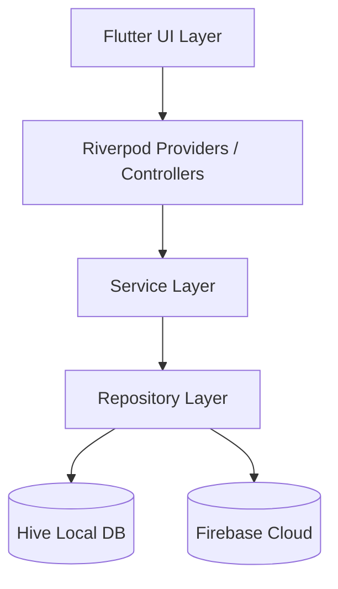

# BÁO CÁO CODEBASE DỰ ÁN PHẦN MỀM

## 1. Thông tin tổng quan dự án

### Thông tin cơ bản
* **Tên dự án**: VitaminC - Ứng dụng học tiếng Anh thông minh
* **Trạng thái dự án**: Đã hoàn thành 100% Sprint 1, Sprint 2, Sprint 3, Sprint 4 và Sprint 4 Nâng cao. Đang trong giai đoạn triển khai **Sprint 5** (Hoàn thiện, Tối ưu Hiệu năng & Trải nghiệm Người dùng).

### Chức năng chính
* **Danh sách chức năng cốt lõi**:
  * Quản lý tài khoản (Đăng nhập Email, Google, Facebook).
  * Quản lý thư viện thẻ từ vựng (CRUD Deck, Vocab, Import từ Excel, Clone từ Global Decks).
  * Ôn tập lặp ngắt quãng (Flashcard lật 3D kết hợp thuật toán SM-2).
  * Đồng bộ hóa dữ liệu ngoại tuyến (Offline-First Sync với Hive CE và Firestore).
* **Danh sách chức năng hỗ trợ**:
  * Đọc phát âm tự động (Text-to-Speech).
  * Trợ lý ảo AI giáo viên tiếng Anh (Gemini).
  * Kiểm tra phát âm qua Micro (Speech-to-Text & Levenshtein).
  * Gamification (Theo dõi chuỗi ngày học - Streak, Bảng xếp hạng Real-time, Hệ thống Huy hiệu, Vòng quay Lucky Spin).
  * Quét từ vựng qua Camera/Ảnh (OCR).
  * Hệ thống Chat đa phòng (Tạo phòng, Tham gia bằng Join Code, Rời phòng/Xóa phòng tự động).
  * Hệ thống Nhiệm vụ đồng đội Co-op Quest (Nhiều cột mốc phần thưởng Milestones/Tiers).
  * Hệ thống XP kép (XP tổng + XP ngày) với tự động reset mỗi ngày.
* **Chức năng tương lai (Sprint 5)**: Quên mật khẩu, Auto-sign-out khi token hết hạn, Empty states & Shimmer loading, Deep link từ FCM, Memory leak prevention (dispose), Force sync, Đóng gói APK.

---

## 2. Kiến trúc hệ thống

### Kiến trúc tổng thể
* **Mô hình kiến trúc**: Feature-First kết hợp với State Notifier Pattern (quản lý bởi Riverpod).
* **Sơ đồ kiến trúc tổng quan**:


```mermaid
graph TD
    UI[Flutter UI Layer] --> State[Riverpod Providers / Controllers]
    State --> Service[Service Layer]
    Service --> Repo[Repository Layer]
    Repo --> LocalDB[(Hive Local DB)]
    Repo --> RemoteDB[(Firebase Cloud)]
```

* **Luồng dữ liệu chính**: 
  1. Offline-First: UI đọc/ghi trực tiếp vào Local DB (Tốc độ cao, hỗ trợ mất mạng).
  2. Sync: Background process lắng nghe Local DB và đồng bộ lên Firestore thông qua `SyncQueue`.

### Thành phần hệ thống

| Thành phần | Vai trò |
| --- | --- |
| Frontend | Flutter (Đảm nhiệm UI/UX đa nền tảng, quản lý điều hướng với GoRouter). |
| Backend | Firebase (Quản lý User Session, Logic phân quyền cơ bản). |
| Database | Cloud Firestore (DB đám mây), Hive CE (NoSQL DB Local). |
| Cache | State Provider (Cache Memory trên Riverpod), Hive (Cache Disk). |
| Message Queue | Bảng `syncQueueBox` trong Hive (lưu hàng đợi các tác vụ chưa đồng bộ). |
| AI Module | Google Generative AI (Chatbot) + thuật toán Levenshtein (Chấm điểm phát âm). |
| Authentication | Firebase Authentication (Email/Pass, OAuth Google/Facebook). |

---

## 3. Công nghệ sử dụng

### Ngôn ngữ lập trình + framework

| Công nghệ | Phiên bản |
| --- | --- |
| Dart | Tương thích Flutter 3.x |
| Flutter | Framework phát triển Mobile |

### Các thư viện chính

| Framework / Package | Mục đích |
| --- | --- |
| `flutter_riverpod` | Quản lý State toàn cục (State Management). |
| `go_router` | Quản lý định tuyến và Deep linking an toàn. |
| `firebase_core`, `firebase_auth`, `cloud_firestore` | Kết nối Backend và Database đám mây. |
| `hive_ce`, `hive_ce_flutter` | Cơ sở dữ liệu NoSQL lưu trữ Offline. |
| `google_generative_ai` | Tích hợp Gemini LLM cho trợ lý ảo. |
| `speech_to_text`, `flutter_tts` | Nhận diện giọng nói và Đọc văn bản. |
| `google_mlkit_text_recognition` | OCR bóc tách chữ từ hình ảnh. |
| `flutter_local_notifications` | Push notification cục bộ nhắc học bài (Streak). |

---

## 4. Cấu trúc thư mục

```text
lib/
├── core/                # Tài nguyên dùng chung
│   ├── constants/       # Hằng số (Màu sắc, Typography)
│   ├── models/          # Model Core (UserModel, SyncQueue, LocalVocab)
│   ├── services/        # Service dùng chung (LocalDbService, Notification)
│   ├── shared_widgets/  # Các UI Component tái sử dụng (Button, AppBar...)
│   └── utils/           # Tiện ích (Global Exception Handler, Constants)
├── features/            # Các tính năng chính (Feature-First)
│   ├── auth/            # Xác thực, Onboarding, Đăng nhập
│   ├── dashboard/       # Màn hình chính, Thống kê, Streak
│   ├── library/         # Thư viện thẻ, CRUD, Import Excel, Global Decks
│   ├── settings/        # Cài đặt, Cập nhật thông tin User
│   ├── social/          # Bảng xếp hạng, Huy hiệu, Chat đa phòng, Co-op Quest, Lucky Spin
│   ├── study/           # Giao diện ôn tập lật thẻ, Thuật toán SRS
│   └── tools/           # Chatbot AI, Kiểm tra phát âm, OCR
├── routing/             # Cấu hình GoRouter + Guard Redirect + Dynamic route /social/chat/:roomId
└── main.dart            # Entry point, khởi tạo dịch vụ
```

Vai trò: Phân tách rõ ràng giữa Core (Tái sử dụng) và Features (Độc lập logic). Trong mỗi Feature lại chia theo Data - Presentation giúp code dễ test và bảo trì.

---

## 5. Phân tích module

### 5.1. Module Study (Học tập & SRS)
* **Mục tiêu**: Quản lý phiên học, hiển thị Flashcard và tính toán ngày ôn tập tiếp theo.
* **Chức năng**: Load thẻ cần ôn (Due cards), nhận đánh giá (Hard/Good/Easy), tính toán và cập nhật.
* **Đầu vào**: `deckId` (tùy chọn) để lọc thẻ.
* **Đầu ra**: `VocabModel` được cập nhật `nextReview`, `interval`, `repetition`.
* **Phụ thuộc**: `LocalDbService` (Lấy thẻ), `SrsEngine` (Tính toán).
* **File liên quan**: `study_controller.dart`, `srs_engine.dart`, `flashcard_screen.dart`.

### 5.2. Module Local DB Sync (Đồng bộ Offline)
* **Mục tiêu**: Đảm bảo app hoạt động không cần mạng và đồng bộ ẩn khi có kết nối.
* **Chức năng**: Lưu cache từ vựng, bắt tác vụ cập nhật vào Queue, Batch write lên Firestore.
* **Đầu vào**: Tác vụ update/delete thẻ từ người dùng.
* **Đầu ra**: Dữ liệu đồng nhất giữa Hive và Firestore.
* **Phụ thuộc**: `connectivity_plus`, `cloud_firestore`.
* **File liên quan**: `local_db_service.dart`, `vocab_local.dart`, `sync_queue_item.dart`.

### 5.3. Module Luyện Phát Âm (Pronunciation)
* **Mục tiêu**: Hỗ trợ người dùng luyện phát âm theo từng chủ đề thực tế.
* **Chức năng**: Chọn chủ đề (Giao tiếp, Du lịch...), xem danh sách các câu hỏi, thực hành đọc và nhận phản hồi chấm điểm.
* **Đầu vào**: `topicId` từ màn hình danh sách chủ đề.
* **Đầu ra**: Phản hồi đúng/sai và điểm số từng câu qua `SpeechToText`.
* **Phụ thuộc**: `speech_to_text`, `flutter_tts`, `Riverpod` (quản lý state chủ đề).
* **File liên quan**: `pronunciation_topic_screen.dart`, `pronunciation_screen.dart`, `mock_pronunciation_data.dart`.

### 5.4. Tối ưu Giao diện (UI/UX) & Dashboard
* **Trang chủ (Home)**: Tích hợp đầy đủ các công cụ (Quét từ vựng, Luyện phát âm, Chat AI, Huy hiệu) để người dùng thao tác nhanh.
* **Theo dõi tiến độ thẻ**: Thêm chỉ báo trực quan về thời gian cần ôn tập (`nextReview`) cho từng Flashcard trong chi tiết Bộ thẻ, giúp người dùng chủ động học tập.

---

## 6. Luồng

* **Luồng Học từ (SRS & Sync)**:
  1. Người dùng vào Học → Hệ thống query Hive box lọc ra thẻ có `nextReview <= today`.
  2. Người dùng đánh giá độ khó thẻ (Hard/Good/Easy).
  3. App cập nhật thẻ lưu đè vào Hive box, đồng thời `insert` 1 task update vào `SyncQueueBox`.
  4. Hàm `processSyncQueue` chạy ngầm, kiểm tra mạng. Nếu có, bốc toàn bộ queue đẩy Batch lên Firestore và xóa queue.
* **Luồng Xác thực & Phân quyền**:
  1. `routerProvider` được gắn Notifier lắng nghe `authStateProvider`.
  2. Khi Firebase Auth trả về User, GoRouter tự động redirect từ `/login` sang `/home`. 

---

## 7. Phân tích mã nguồn

### Class Diagram (Danh sách lớp chính)

| Class | Vai trò |
| --- | --- |
| `UserModel` | Lưu thông tin User, XP, dailyXp, dailyGoal, lastActiveDate, Rank, Streak, Danh sách Huy hiệu. |
| `DeckModel` | Chứa Metadata bộ thẻ (Title, Desc, Date). |
| `VocabModel` | Chứa từ vựng và chỉ số SM-2 (easinessFactor, interval, repetition). |
| `VocabLocal` | Wrapper của VocabModel để lưu xuống Hive (tuân thủ TypeAdapter). |
| `SyncQueueItem` | Lưu lại tác vụ chưa đồng bộ (`action`: update/delete, `vocabId`). |
| `ChatRoom` | Chứa thông tin phòng chat (id, name, joinCode, members, lastMessage). |
| `ChatMessage` | Chứa tin nhắn trong phòng chat (text, senderId, senderName, timestamp). |
| `CoopTier` | Định nghĩa cột mốc nhiệm vụ đồng đội (target, xpReward, title). |
| `AppExceptionHandler` | Wrapper bắt lỗi tập trung (Firestore, Socket, Auth) thành Tiếng Việt. |

### Quan hệ giữa các lớp
* **Dependency**: `StudyController` phụ thuộc vào `SrsEngine` để tính toán. Các `Repository` phụ thuộc vào `FirebaseFirestore`. `VocabLocal` phụ thuộc vào `VocabModel` (chuyển đổi qua lại).

### Hàm quan trọng

#### `processReview(VocabModel card, ReviewQuality quality)` trong `SrsEngine`
* **Chức năng**: Áp dụng SM-2, tính ngày ôn thẻ kế tiếp.
* **Tham số đầu vào**: Thẻ hiện tại (`card`), Mức độ đánh giá (`quality` = Hard/Good/Easy).
* **Giá trị trả về**: `VocabModel` bản sao mới đã cập nhật chỉ số (`interval`, `EF`, `nextReview`).
* **Ngoại lệ**: Không. Đảm bảo an toàn qua cơ chế copyWith (Immutability).

#### `syncVocabsFromFirestore(String uid)` trong `LocalDbService`
* **Chức năng**: Kéo dữ liệu trên Cloud về Local.
* **Tham số đầu vào**: `uid` của user.
* **Giá trị trả về**: Void (Dữ liệu ghi vào Hive).
* **Ngoại lệ**: Bắt lỗi mất mạng (SocketException). Có cơ chế Delta Sync: Chỉ tải về các `doc` có `updatedAt > lastSyncTime`.

---

## 8. Cơ sở dữ liệu

### Database Schema (Cloud Firestore)

```text
Collection: users
 └── Document: {uid}
      (Fields: email, displayName, role, xp, dailyXp, dailyGoal, lastActiveDate, streak_count, rank, earnedBadges...)
      ├── Sub-collection: decks
      │    └── Document: {deckId} (title, description, coverImageUrl...)
      ├── Sub-collection: vocabs
      │    └── Document: {vocabId} (word, meaning, SRS fields...)
      └── Sub-collection: chatbot
           └── Document: history (Lưu mảng hội thoại Gemini)

Collection: global_decks (Sử dụng cho Mẫu cộng đồng)
 └── Document: {globalDeckId}
      └── Sub-collection: vocabs

Collection: chat_rooms (Hệ thống Chat đa phòng)
 └── Document: {roomId}
      (Fields: name, joinCode, members[], lastMessage, lastMessageTime, createdAt)
      └── Sub-collection: messages
           └── Document: {messageId} (text, senderId, senderName, timestamp)

Collection: quests (Nhiệm vụ đồng đội)
 └── Document: weekly_coop (totalFlipped: int)
```

### Chi tiết
* **Local DB (Hive)**: Dùng `typeId: 0` cho `VocabLocal` và `typeId: 1` cho `SyncQueueItem`. Sử dụng khóa chính (Key) là `id` của document Firestore để dễ dàng map 1-1.

---

## 9. Thuật toán và xử lý đặc biệt

### Thuật toán Lặp Ngắt Quãng (SuperMemo-2 / SM-2)
* **Mục đích**: Tối ưu hóa thời gian ghi nhớ, đưa thẻ khó lặp lại sớm, đẩy lùi thẻ dễ ra xa.
* **Mô tả**:
```text
Input: Thẻ hiện tại (repetition, interval, easinessFactor), Điểm (Hard=1, Good=2, Easy=3).
Process:
  - Nếu Hard: repetition = 0, interval = 1, EF giảm 0.2 (min 1.3).
  - Nếu Good/Easy: repetition tăng 1. 
    + Lần 1: interval = 1.
    + Lần 2: interval = 6.
    + Lần 3+: interval = interval * EF. (Nếu Easy, EF tăng 0.15).
Output: Ngày ôn tập tiếp theo = Now + interval (ngày).
```

### Thuật toán Đánh giá Phát âm (Khoảng cách Levenshtein)
* **Mục đích**: Chấm điểm mức độ tương đồng giữa câu phát âm của user và mẫu chuẩn.
* **Mô tả**:
```text
Input: Chuỗi chuẩn (a), Chuỗi nhận diện được qua Micro (b) -> Đã loại bỏ ký tự đặc biệt & tách mảng.
Process:
  Tính số bước chuyển đổi (Thêm, Xóa, Sửa) ít nhất biến mảng b thành mảng a.
  Ngưỡng chấp nhận (Threshold) = Độ dài tối đa * 0.3. Nếu khoảng cách <= Ngưỡng -> Từ đó Đọc đúng.
Output: % số từ đúng trên tổng số từ. (Được hiển thị trực quan qua màu chữ).
```

---

## 10. Chi Tiết Từng File

### 10.1 `main.dart` — Entry Point
* Khởi tạo `WidgetsFlutterBinding`, load `.env`, khởi tạo `Firebase`, `Hive CE` và `NotificationService`.
* Khai báo xử lý lỗi toàn cục (`FlutterError.onError` và `PlatformDispatcher.instance.onError`).
* Bọc app trong `ProviderScope` (Riverpod).
* `VitaminCApp` là `ConsumerWidget`, dùng `MaterialApp.router` với `routerConfig` từ `routerProvider`.
* Theme: Material 3, font Lexend, màu chủ đạo `AppColors.primary`.

### 10.2 `hive_registrar.g.dart` — Đăng ký Type Adapter
* Chứa mã tự động sinh (auto-generated) để đăng ký các Adapter cho cơ sở dữ liệu Hive. Đăng ký thành công `VocabLocalAdapter` và `SyncQueueItemAdapter` vào hệ thống lưu trữ Hive cục bộ.

### 10.3 `routing/app_router.dart` — Điều hướng
* **`RouterNotifier`**: Lắng nghe `authStateProvider` + `currentUserProvider`, gọi `notifyListeners()` khi auth thay đổi.
* **`redirect()`**: Logic bảo vệ route:
  * Chưa đăng nhập → redirect `/login`.
  * Đã đăng nhập mà đang ở auth path → redirect `/home`.
* **Routes**:
  * Độc lập: `/splash`, `/onboarding`, `/login`.
  * `ShellRoute` (có BottomNav): `/home`, `/library`, `/social`, `/settings`.
  * Full-screen: `/deck-detail`, `/add-vocab`, `/study`, `/study-summary`, `/pronunciation`, `/chatbot`, `/ocr`.
  * Dynamic: `/social/chat/:roomId` — Điều hướng động vào phòng chat cụ thể (nhận `roomId` từ path, `name` từ query params).

### 10.4 `core/` — Tầng dùng chung
* **`constants/app_colors.dart`**: Bảng màu Slate (100→900), accent (gold, bronze, streakOrange), trạng thái (success/warning/error).
* **`models/sync_queue_item.dart`**: Khai báo Model định nghĩa thông tin hàng đợi đồng bộ local-remote: `vocabId`, `action` (update/delete), `createdAt`.
* **`models/sync_queue_item.g.dart`**: Adapter serialization tự sinh cho `SyncQueueItem`.
* **`models/user_model.dart`**: Fields: `uid`, `email`, `displayName`, `photoUrl`, `role` (admin/user), `xp`, `rank`, `earnedBadges`. Có `toMap()` / `fromMap()` cho Firestore serialization.
* **`models/vocab_local.dart`**: Model từ vựng lưu trữ cục bộ dùng Hive. Chuyển đổi dữ liệu 2 chiều từ và sang `VocabModel` của Firestore.
* **`models/vocab_local.g.dart`**: Adapter serialization tự sinh cho `VocabLocal`.
* **`services/local_db_provider.dart`**: Cung cấp `localDbServiceProvider` để truy cập `LocalDbService` thông qua Riverpod.
* **`services/local_db_service.dart`**: Xử lý logic cơ sở dữ liệu local (Hive). Thực hiện Delta Sync từ Firestore về local (`syncVocabsFromFirestore`), truy vấn thẻ đến hạn (`getLocalDueCards`), quản lý queue đồng bộ (`addToSyncQueue`, `processSyncQueue`) và xóa sạch dữ liệu khi đăng xuất (`clearAllData`).
* **`services/notification_service.dart`**: Lên lịch và cấu hình local notifications hằng ngày bằng múi giờ địa phương (`scheduleDailyStreakReminder`). Bắt và hiển thị thông báo FCM.
* **`utils/app_exception_handler.dart`**: Bắt lỗi trung tâm, hiển thị UI qua `rootScaffoldMessengerKey`.
* **`utils/firestore_collections.dart`**: Định nghĩa tên collection: `users`, `global_decks`, `decks` (sub), `vocabs` (sub).
* **Shared Widgets**:
  * `bottom_nav_bar.dart` (`MainBottomNavBar`): 4 tab (Home, Library, Social, Profile), dùng `GoRouter` navigate.
  * `custom_app_bar.dart` (`CustomAppBar`): AppBar trong suốt, nút back tự detect `canPop()`.
  * `custom_button.dart` (`CustomPrimaryButton`): Nút full-width, bo góc 12, màu primary.
  * `custom_label.dart` (`CustomLabel`): Nhãn song ngữ (English - Vietnamese).
  * `custom_text_field.dart` (`CustomTextField`): Input có icon prefix, hỗ trợ password.
  * `srs_button.dart` (`SrsButton`): Nút đánh giá SRS (Hard/Good/Easy).

### 10.5 `features/auth/` — Xác Thực
* **Data Layer**:
  * `repositories/auth_repository.dart` — Logic xác thực chính:
    * `getUserData(uid)`: Lấy UserModel từ Firestore.
    * `signInEmail(email, pass)`: Đăng nhập email/password.
    * `signUpEmail(email, pass, name)`: Tạo tài khoản + lưu Firestore.
    * `signInWithGoogle()`: OAuth Google → lưu Firestore nếu mới.
    * `signInWithFacebook()`: OAuth Facebook → lưu Firestore nếu mới.
    * `_updateUserInFirestore(user)`: Helper: chỉ tạo doc nếu chưa tồn tại (tránh ghi đè role).
    * `signOut()`: Đăng xuất cả Google, Facebook, Firebase.
  * `user_service.dart`: `updateUserProfile()`: Đồng bộ displayName + photoUrl lên cả Firebase Auth và Firestore.
* **Presentation Layer**:
  * `providers/auth_provider.dart`: Cung cấp `authRepositoryProvider`, `userServiceProvider`, `authStateProvider` (nghe trạng thái) và `currentUserProvider` (Future lấy data).
  * Screens:
    * `screens/splash_screen.dart`: Hiển thị logo fade-in, nền primary.
    * `screens/onboarding_screen.dart`: 3 slide dùng PageView, dot indicator animated.
    * `screens/login_screen.dart`: Form Login/Register chung, chuyển đổi bằng `AuthTabSwitcher`. Có nút Google + Facebook. Logic redirect tự động qua routerProvider.
    * `screens/register_screen.dart`: Form đăng ký, nhận submit button từ parent.
  * Widgets:
    * `widgets/auth_tab_switcher.dart`: Widget tùy chỉnh giúp hoán đổi linh hoạt giữa các tab đăng nhập và đăng ký với animation mượt mà.

### 10.6 `features/dashboard/` — Trang Chủ
* **Data Layer**:
  * `data/dashboard_service.dart`: `getLearnedVocabCount(uid)` đếm vocab có repetition > 0; `getTotalVocabCount(uid)` đếm tổng vocab.
  * `data/streak_service.dart`: `getStreakCount(uid)` tính streak hiện tại; `updateStreak(uid)` cập nhật streak an toàn bằng transaction.
* **Presentation Layer**:
  * `providers/dashboard_providers.dart`: streakCountProvider, learnedVocabCountProvider, totalVocabCountProvider.
  * `screens/home_screen.dart` — Giao diện chính:
    * **TopBar**: Avatar + viền theo rank (gold/bạc/đồng), badge streak 🔥, XP.
    * **SearchBar**: Ô tìm kiếm + nút AI chatbot.
    * **StatsCards**: 2 card (Streak + Từ đã học) dùng CircularPercentIndicator.
    * **DailyGoal**: Mục tiêu XP ngày (hardcoded 20/30).
    * **ContinueLearning**: Card "3000 từ Oxford" + nút Học.
    * **CommonPhrases**: Card mẫu câu (khóa).

### 10.7 `features/library/` — Thư Viện Thẻ (Library)
* **Data Layer**:
  * `data/library_service.dart`: CRUD Deck & Vocab trên Firestore.
  * `data/global_deck_service.dart`: Clone bài từ Global Decks.
  * `data/import_service.dart`: Nhập từ vựng hàng loạt từ file Excel.
  * `data/models/deck_model.dart`: Model dữ liệu định nghĩa các trường thông tin bộ thẻ.
  * `data/models/vocab_model.dart`: Model từ vựng chứa nghĩa, ví dụ, ảnh và metadata SM-2.
* **Presentation Layer**:
  * `presentation/controllers/deck_detail_controller.dart`: Quản lý danh sách Vocab bên trong một Deck.
  * `presentation/controllers/library_controller.dart`: Quản lý danh sách Deck ngoài màn hình thư viện.
  * `presentation/library_providers.dart`: Khai báo providers cấp phát các service và controller thư viện.
  * Screens:
    * `presentation/screens/deck_list_screen.dart`: Grid hiển thị các Deck, icon trạng thái học, chức năng tải/clone.
    * `presentation/screens/deck_detail_screen.dart`: Danh sách từ trong 1 Deck.
    * `presentation/screens/add_vocab_screen.dart`: Form thêm thẻ (Từ, Nghĩa, Ví dụ).

### 10.8 `features/study/` — Ôn Tập Flashcard (Study)
* **Data Layer**: 
  * `data/srs_engine.dart` chứa thuật toán SM-2 cập nhật chỉ số lặp lại.
  * `data/study_service.dart` lấy thẻ cần học từ Local DB và đưa vào Sync Queue.
* **Presentation Layer**:
  * `presentation/controllers/study_controller.dart`: Lấy state, quản lý index thẻ, gọi cập nhật thẻ sau ôn tập.
  * `presentation/study_providers.dart`: Khai báo providers phục vụ học tập.
  * Screens:
    * `presentation/screens/flashcard_screen.dart`: Hiệu ứng lật 3D, tích hợp nút SRS.
    * `presentation/screens/study_summary_screen.dart`: Kết quả buổi học.

### 10.9 `features/social/` — Gamification & Chat (Social)
* **Data Layer**: 
  * `data/badge_service.dart` kiểm tra điều kiện cấp huy hiệu (First Blood, Streak 7, Streak 30...).
  * `data/chat_service.dart`: Service quản lý phòng chat đa phòng. Bao gồm tạo phòng (`createGroupRoom` - sinh Join Code 6 ký tự), tham gia phòng (`joinRoomByCode`), rời/xóa phòng (`leaveRoom` - tự dọn phòng trống), lắng nghe danh sách phòng (`getUserRooms` - sort client-side), gửi tin nhắn (`sendMessage` - batch write) và lắng nghe tin nhắn (`getMessages`).
  * `data/quest_service.dart`: Service quản lý nhiệm vụ cá nhân hàng ngày (Daily Quests) và khởi tạo lại khi qua ngày mới.
  * `data/models/chat_room.dart`: Model `ChatRoom` (id, name, joinCode, members, lastMessage, lastMessageTime).
  * `data/models/chat_message.dart`: Model `ChatMessage` (id, text, senderId, senderName, timestamp).
* **Presentation Layer**:
  * `presentation/providers/social_providers.dart`: Khai báo leaderboardProvider, badgeServiceProvider và chatServiceProvider.
  * Screens:
    * `presentation/screens/leaderboard_screen.dart`: Ranking Top 50 + Tabs (Ranking, Badges, Chat, Co-op).
    * `presentation/screens/badges_screen.dart`: Màn hình Huy hiệu đã đạt/khóa.
    * `presentation/screens/chat_room_list_screen.dart`: Danh sách phòng chat đang tham gia, nút FAB tạo/join, thao tác Swipe-to-leave, nút (?) hướng dẫn sử dụng.
    * `presentation/screens/chat_room_screen.dart`: Giao diện chat trong 1 phòng cụ thể (theo roomId), hỗ trợ validation English-only.
    * `presentation/screens/coop_quest_screen.dart`: Bảng nhiệm vụ đồng đội tuần (Co-op Quest) với nhiều cột mốc phần thưởng (Milestones/Tiers), thanh tiến trình động đọc từ Firestore.
    * `presentation/screens/lucky_spin_screen.dart`: Giao diện vòng quay may mắn (Daily Gacha).
  * Widgets:
    * `presentation/widgets/streak_popup.dart`: Animation popup chúc mừng chuỗi ngày học, hiển thị XP thực tế và ngày/thứ chính xác.

### 10.10 `features/tools/` — AI, OCR & Speech (Tools)
* **Data Layer**:
  * `data/ai_service.dart`: Tương tác Gemini LLM (hỏi đáp Tiếng Anh).
  * `data/speech_service.dart`: Khởi tạo engine `SpeechToText`, thu âm giọng nói của người dùng và tính khoảng cách Levenshtein để chấm điểm phát âm.
  * `data/tts_service.dart`: Flutter TTS đọc tiếng Anh chuẩn.
* **Presentation Layer**:
  * Screens:
    * `presentation/screens/chatbot_screen.dart`: Chat UI kiểu bong bóng.
    * `presentation/screens/ocr_scanner_screen.dart`: Giao diện quét camera/ảnh để nhận diện văn bản tiếng Anh bằng ML Kit, trích xuất và lọc từ vựng để thêm nhanh.
    * `presentation/screens/pronunciation_screen.dart`: Giao diện chấm điểm phát âm, hiển thị sóng âm khi ghi âm, tô màu xanh/đỏ cho các từ phát âm đúng/sai và underline lượn sóng cho từ lỗi.

### 10.11 `features/settings/` — Cài Đặt (Settings)
* **Presentation Layer**:
  * `presentation/screens/settings_screen.dart`: Đổi tên hiển thị, Test chức năng Sync Offline, Điều hướng đến các Tools, Đăng xuất (xóa Local Cache).

---

## 11. Tổng Kết Thống Kê Codebase

| Metric | Giá trị |
| --- | --- |
| Tổng số file Dart | **~68 files** (bao gồm file code tay và file auto-generated) |
| Số lượng màn hình (Screens) | **18 screens** |
| Số lượng Riverpod Provider | **~18 providers** |
| Số lượng Service/Repository | **10 service classes** |
| Số lượng Model | **8 models** (User, Deck, Vocab, SyncQueueItem, LocalVocab, ChatRoom, ChatMessage, CoopTier) |
